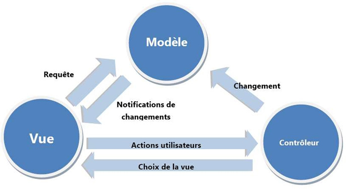

<h1>设计模式-MVC</h1>
 		<h3>MVC：包括Model、View、Controller,它的意义在于将数据与表现解耦，提高代码可复用性，特别是model部分.</h3>
<ol>
		<li>Model指的是数据模型，是指对数据、业务逻辑抽象出来的一个模块，实现数据模型的可复用性</li>
		<li>View指的是视图，是从model获取数据后的表现，是与用户交互的界面</li>
		<li>Controller指的是控制器，model和view之间不会直接打交道，controller来起到桥梁的作用，决定用哪些model，决定view显示什么数据</li>
</ol>

<strong>Model</strong>
		<ul>
			<li>数据、行为、方法是Model的主要内容；</li>
			<li>Model是MVC模式中代码量最大、逻辑最复杂的地方，关于业务逻辑的部分都在这表示</li>
			<li>Model提供的数据都是原始数据，不负责表现层的任何代码即View的工作</li>
			<li>Model的输入数据可以是带有表现格式的数据，所以需要对数据数据进行过滤、验证、规范化预处理</li>
			<li>Model是处理业务方面的逻辑，Controller只是处理Model和View的关系，所以应该是胖Model，瘦Controller</li>
		</ul>
<strong>Controller</strong>
		<ul>
			<li>用于处理用户请求。因此，对于reqeust的访问代码应该放在Controller里面，比如 $_GET $_POST 等。 但仅限于获取用户请求数据，不应该对数据有任何操作或预处理，这些工作应该交由Models来完成。</li>
			<li>调用Models的读方法，获取数据，直接传递给视图，供显示。当涉及到多个Model时，有关的逻辑应当交给Model来完成。</li>
			<li>调用Models的类方法，对Models进行写操作。</li>
			<li>调用视图渲染函数等，形成对用户Reqeust的Response。</li>
		</ul>
<strong>View</strong>
		<ul>
			<li>view视图层只负责展示数据，以html为主</li>
			<li>不应该进行太多的条件判断或者复杂的运算过程，可以有简单的循环或者格式化语句</li>
			<li>从来不调用Model的方法，只读不写</li>
		</ul>
